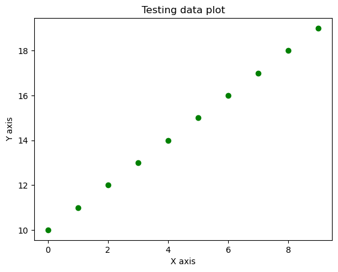
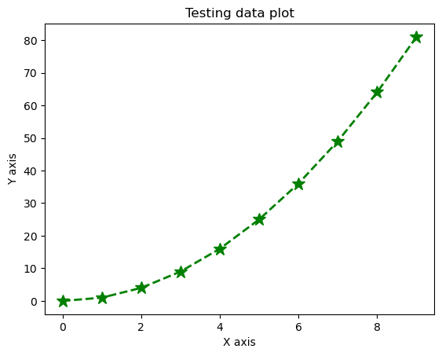
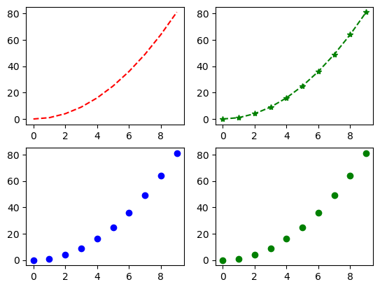
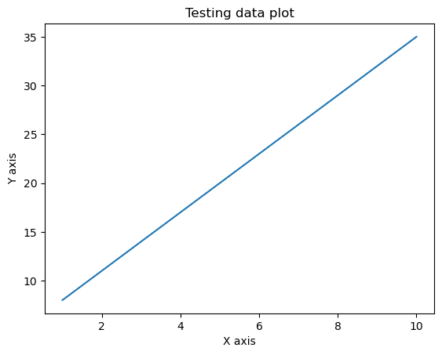
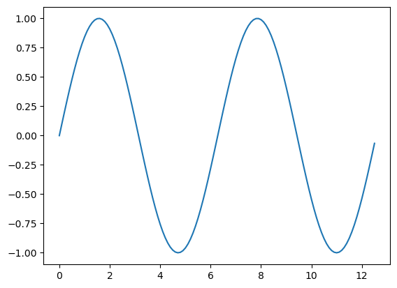
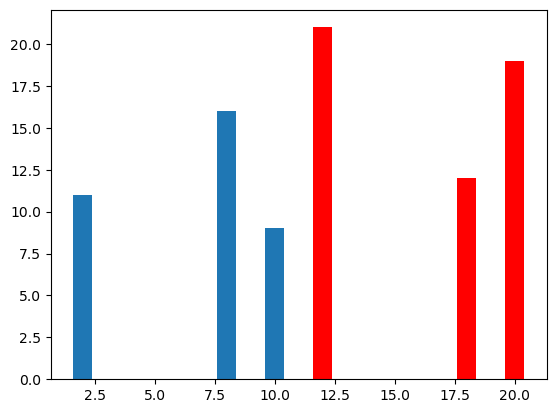

# Matplotlib Library


```python
import numpy as np
import matplotlib.pyplot as plt
%matplotlib inline
```


```python
#Ex: 2-D Scatter plot
x=np.arange(0,10)
y=np.arange(10,20)
plt.scatter(x,y,c='g')
plt.xlabel('X axis')
plt.ylabel('Y axis')
plt.title('Testing data plot')
```


    Text(0.5, 1.0, 'Testing data plot')


    

    


```python
#Ex: 2-D plot
y=x*x
plt.plot(x,y,'g*',linestyle='dashed',linewidth=2, markersize=12)
plt.xlabel('X axis')
plt.ylabel('Y axis')
plt.title('Testing data plot')
```


    Text(0.5, 1.0, 'Testing data plot')


    

    


```python
#Ex:Subplot
plt.subplot(2,2,1)
plt.plot(x,y,'r--')

plt.subplot(2,2,2)
plt.plot(x,y,'g*--')

plt.subplot(2,2,3)
plt.plot(x,y,'bo')

plt.subplot(2,2,4)
plt.plot(x,y,'go')
```


    [<matplotlib.lines.Line2D at 0x2ace627f610>]


    

    


```python
#Ex: 
x=np.arange(1,11)
y = 3*x+5
plt.plot(x,y)
plt.xlabel('X axis')
plt.ylabel('Y axis')
plt.title('Testing data plot')
```


    Text(0.5, 1.0, 'Testing data plot')


    

    


```python
np.pi
```


    3.141592653589793


```python
x=np.arange(0,4*np.pi,0.1)
y=np.sin(x)
plt.plot(x,y)
```


    [<matplotlib.lines.Line2D at 0x2ace6ce3460>]


    

    


```python
#Ex
x=[2,8,10]
y=[11,16,9]

x1=[12,18,20]
y1=[21,12,19]

plt.bar(x,y)
plt.bar(x1,y1,color='r')
```


    <BarContainer object of 3 artists>


    

    


```python

```
