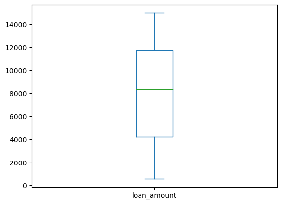
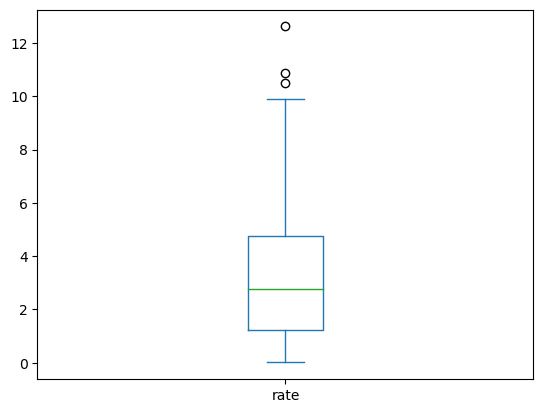

```python
import numpy as np
import pandas as pd
import matplotlib.pyplot as plt
import seaborn as sns
```


```python
#Import the dataset
pd.read_csv('Day32.csv')

```


<div>
<style scoped>
    .dataframe tbody tr th:only-of-type {
        vertical-align: middle;
    }

    .dataframe tbody tr th {
        vertical-align: top;
    }

    .dataframe thead th {
        text-align: right;
    }
</style>
<table border="1" class="dataframe">
  <thead>
    <tr style="text-align: right;">
      <th></th>
      <th>client_id</th>
      <th>loan_type</th>
      <th>loan_amount</th>
      <th>repaid</th>
      <th>loan_id</th>
      <th>loan_start</th>
      <th>loan_end</th>
      <th>rate</th>
    </tr>
  </thead>
  <tbody>
    <tr>
      <th>0</th>
      <td>46109</td>
      <td>home</td>
      <td>13672</td>
      <td>0</td>
      <td>10243</td>
      <td>2002-04-16</td>
      <td>2003-12-20</td>
      <td>2.15</td>
    </tr>
    <tr>
      <th>1</th>
      <td>46109</td>
      <td>credit</td>
      <td>9794</td>
      <td>0</td>
      <td>10984</td>
      <td>2003-10-21</td>
      <td>2005-07-17</td>
      <td>1.25</td>
    </tr>
    <tr>
      <th>2</th>
      <td>46109</td>
      <td>home</td>
      <td>12734</td>
      <td>1</td>
      <td>10990</td>
      <td>2006-02-01</td>
      <td>2007-07-05</td>
      <td>0.68</td>
    </tr>
    <tr>
      <th>3</th>
      <td>46109</td>
      <td>cash</td>
      <td>12518</td>
      <td>1</td>
      <td>10596</td>
      <td>2010-12-08</td>
      <td>2013-05-05</td>
      <td>1.24</td>
    </tr>
    <tr>
      <th>4</th>
      <td>46109</td>
      <td>credit</td>
      <td>14049</td>
      <td>1</td>
      <td>11415</td>
      <td>2010-07-07</td>
      <td>2012-05-21</td>
      <td>3.13</td>
    </tr>
    <tr>
      <th>...</th>
      <td>...</td>
      <td>...</td>
      <td>...</td>
      <td>...</td>
      <td>...</td>
      <td>...</td>
      <td>...</td>
      <td>...</td>
    </tr>
    <tr>
      <th>438</th>
      <td>26945</td>
      <td>other</td>
      <td>12963</td>
      <td>0</td>
      <td>10330</td>
      <td>2001-11-26</td>
      <td>2004-06-11</td>
      <td>2.46</td>
    </tr>
    <tr>
      <th>439</th>
      <td>26945</td>
      <td>credit</td>
      <td>1728</td>
      <td>1</td>
      <td>10248</td>
      <td>2004-01-27</td>
      <td>2005-06-21</td>
      <td>5.27</td>
    </tr>
    <tr>
      <th>440</th>
      <td>26945</td>
      <td>other</td>
      <td>9329</td>
      <td>0</td>
      <td>10154</td>
      <td>2001-12-17</td>
      <td>2004-07-22</td>
      <td>5.65</td>
    </tr>
    <tr>
      <th>441</th>
      <td>26945</td>
      <td>home</td>
      <td>4197</td>
      <td>0</td>
      <td>10333</td>
      <td>2003-10-16</td>
      <td>2005-07-10</td>
      <td>4.50</td>
    </tr>
    <tr>
      <th>442</th>
      <td>26945</td>
      <td>home</td>
      <td>3643</td>
      <td>0</td>
      <td>11434</td>
      <td>2010-03-24</td>
      <td>2011-12-22</td>
      <td>0.13</td>
    </tr>
  </tbody>
</table>
<p>443 rows × 8 columns</p>
</div>


```python
df = pd.read_csv('Day32.csv', index_col='client_id')
df
```


<div>
<style scoped>
    .dataframe tbody tr th:only-of-type {
        vertical-align: middle;
    }

    .dataframe tbody tr th {
        vertical-align: top;
    }

    .dataframe thead th {
        text-align: right;
    }
</style>
<table border="1" class="dataframe">
  <thead>
    <tr style="text-align: right;">
      <th></th>
      <th>loan_type</th>
      <th>loan_amount</th>
      <th>repaid</th>
      <th>loan_id</th>
      <th>loan_start</th>
      <th>loan_end</th>
      <th>rate</th>
    </tr>
    <tr>
      <th>client_id</th>
      <th></th>
      <th></th>
      <th></th>
      <th></th>
      <th></th>
      <th></th>
      <th></th>
    </tr>
  </thead>
  <tbody>
    <tr>
      <th>46109</th>
      <td>home</td>
      <td>13672</td>
      <td>0</td>
      <td>10243</td>
      <td>2002-04-16</td>
      <td>2003-12-20</td>
      <td>2.15</td>
    </tr>
    <tr>
      <th>46109</th>
      <td>credit</td>
      <td>9794</td>
      <td>0</td>
      <td>10984</td>
      <td>2003-10-21</td>
      <td>2005-07-17</td>
      <td>1.25</td>
    </tr>
    <tr>
      <th>46109</th>
      <td>home</td>
      <td>12734</td>
      <td>1</td>
      <td>10990</td>
      <td>2006-02-01</td>
      <td>2007-07-05</td>
      <td>0.68</td>
    </tr>
    <tr>
      <th>46109</th>
      <td>cash</td>
      <td>12518</td>
      <td>1</td>
      <td>10596</td>
      <td>2010-12-08</td>
      <td>2013-05-05</td>
      <td>1.24</td>
    </tr>
    <tr>
      <th>46109</th>
      <td>credit</td>
      <td>14049</td>
      <td>1</td>
      <td>11415</td>
      <td>2010-07-07</td>
      <td>2012-05-21</td>
      <td>3.13</td>
    </tr>
    <tr>
      <th>...</th>
      <td>...</td>
      <td>...</td>
      <td>...</td>
      <td>...</td>
      <td>...</td>
      <td>...</td>
      <td>...</td>
    </tr>
    <tr>
      <th>26945</th>
      <td>other</td>
      <td>12963</td>
      <td>0</td>
      <td>10330</td>
      <td>2001-11-26</td>
      <td>2004-06-11</td>
      <td>2.46</td>
    </tr>
    <tr>
      <th>26945</th>
      <td>credit</td>
      <td>1728</td>
      <td>1</td>
      <td>10248</td>
      <td>2004-01-27</td>
      <td>2005-06-21</td>
      <td>5.27</td>
    </tr>
    <tr>
      <th>26945</th>
      <td>other</td>
      <td>9329</td>
      <td>0</td>
      <td>10154</td>
      <td>2001-12-17</td>
      <td>2004-07-22</td>
      <td>5.65</td>
    </tr>
    <tr>
      <th>26945</th>
      <td>home</td>
      <td>4197</td>
      <td>0</td>
      <td>10333</td>
      <td>2003-10-16</td>
      <td>2005-07-10</td>
      <td>4.50</td>
    </tr>
    <tr>
      <th>26945</th>
      <td>home</td>
      <td>3643</td>
      <td>0</td>
      <td>11434</td>
      <td>2010-03-24</td>
      <td>2011-12-22</td>
      <td>0.13</td>
    </tr>
  </tbody>
</table>
<p>443 rows × 7 columns</p>
</div>


```python
df.shape
```


    (443, 7)


```python
df.info()
```

    <class 'pandas.core.frame.DataFrame'>
    Int64Index: 443 entries, 46109 to 26945
    Data columns (total 7 columns):
     #   Column       Non-Null Count  Dtype  
    ---  ------       --------------  -----  
     0   loan_type    443 non-null    object 
     1   loan_amount  443 non-null    int64  
     2   repaid       443 non-null    int64  
     3   loan_id      443 non-null    int64  
     4   loan_start   443 non-null    object 
     5   loan_end     443 non-null    object 
     6   rate         443 non-null    float64
    dtypes: float64(1), int64(3), object(3)
    memory usage: 27.7+ KB
    


```python
df.dtypes
```


    loan_type       object
    loan_amount      int64
    repaid           int64
    loan_id          int64
    loan_start      object
    loan_end        object
    rate           float64
    dtype: object


```python
#Converting the datatype object to date type
#Convert load_id to object datatype
df['loan_id'] = df['loan_id'].astype('object')

#Convert repaid to object/categorical 
df['repaid'] = df['repaid'].astype('category')

#Convert loan_start & loan_end to date type
df['loan_start'] = pd.to_datetime(df['loan_start'], format='%Y-%m-%d')
df['loan_end'] = pd.to_datetime(df['loan_end'], format='%Y-%m-%d')

```


```python
df.dtypes
```


    loan_type              object
    loan_amount             int64
    repaid               category
    loan_id                object
    loan_start     datetime64[ns]
    loan_end       datetime64[ns]
    rate                  float64
    dtype: object


```python
df.describe()
```


<div>
<style scoped>
    .dataframe tbody tr th:only-of-type {
        vertical-align: middle;
    }

    .dataframe tbody tr th {
        vertical-align: top;
    }

    .dataframe thead th {
        text-align: right;
    }
</style>
<table border="1" class="dataframe">
  <thead>
    <tr style="text-align: right;">
      <th></th>
      <th>loan_amount</th>
      <th>rate</th>
    </tr>
  </thead>
  <tbody>
    <tr>
      <th>count</th>
      <td>443.000000</td>
      <td>443.000000</td>
    </tr>
    <tr>
      <th>mean</th>
      <td>7982.311512</td>
      <td>3.217156</td>
    </tr>
    <tr>
      <th>std</th>
      <td>4172.891992</td>
      <td>2.397168</td>
    </tr>
    <tr>
      <th>min</th>
      <td>559.000000</td>
      <td>0.010000</td>
    </tr>
    <tr>
      <th>25%</th>
      <td>4232.500000</td>
      <td>1.220000</td>
    </tr>
    <tr>
      <th>50%</th>
      <td>8320.000000</td>
      <td>2.780000</td>
    </tr>
    <tr>
      <th>75%</th>
      <td>11739.000000</td>
      <td>4.750000</td>
    </tr>
    <tr>
      <th>max</th>
      <td>14971.000000</td>
      <td>12.620000</td>
    </tr>
  </tbody>
</table>
</div>


```python
df['loan_amount'].plot(kind='box')
```


    <Axes: >


    

    


```python
df['rate'].plot(kind='box')
```


    <Axes: >


    

    


```python
df1=df[['loan_amount','rate']]
df1
```


<div>
<style scoped>
    .dataframe tbody tr th:only-of-type {
        vertical-align: middle;
    }

    .dataframe tbody tr th {
        vertical-align: top;
    }

    .dataframe thead th {
        text-align: right;
    }
</style>
<table border="1" class="dataframe">
  <thead>
    <tr style="text-align: right;">
      <th></th>
      <th>loan_amount</th>
      <th>rate</th>
    </tr>
    <tr>
      <th>client_id</th>
      <th></th>
      <th></th>
    </tr>
  </thead>
  <tbody>
    <tr>
      <th>46109</th>
      <td>13672</td>
      <td>2.15</td>
    </tr>
    <tr>
      <th>46109</th>
      <td>9794</td>
      <td>1.25</td>
    </tr>
    <tr>
      <th>46109</th>
      <td>12734</td>
      <td>0.68</td>
    </tr>
    <tr>
      <th>46109</th>
      <td>12518</td>
      <td>1.24</td>
    </tr>
    <tr>
      <th>46109</th>
      <td>14049</td>
      <td>3.13</td>
    </tr>
    <tr>
      <th>...</th>
      <td>...</td>
      <td>...</td>
    </tr>
    <tr>
      <th>26945</th>
      <td>12963</td>
      <td>2.46</td>
    </tr>
    <tr>
      <th>26945</th>
      <td>1728</td>
      <td>5.27</td>
    </tr>
    <tr>
      <th>26945</th>
      <td>9329</td>
      <td>5.65</td>
    </tr>
    <tr>
      <th>26945</th>
      <td>4197</td>
      <td>4.50</td>
    </tr>
    <tr>
      <th>26945</th>
      <td>3643</td>
      <td>0.13</td>
    </tr>
  </tbody>
</table>
<p>443 rows × 2 columns</p>
</div>


```python
df1.head()
```


<div>
<style scoped>
    .dataframe tbody tr th:only-of-type {
        vertical-align: middle;
    }

    .dataframe tbody tr th {
        vertical-align: top;
    }

    .dataframe thead th {
        text-align: right;
    }
</style>
<table border="1" class="dataframe">
  <thead>
    <tr style="text-align: right;">
      <th></th>
      <th>loan_amount</th>
      <th>rate</th>
    </tr>
    <tr>
      <th>client_id</th>
      <th></th>
      <th></th>
    </tr>
  </thead>
  <tbody>
    <tr>
      <th>46109</th>
      <td>13672</td>
      <td>2.15</td>
    </tr>
    <tr>
      <th>46109</th>
      <td>9794</td>
      <td>1.25</td>
    </tr>
    <tr>
      <th>46109</th>
      <td>12734</td>
      <td>0.68</td>
    </tr>
    <tr>
      <th>46109</th>
      <td>12518</td>
      <td>1.24</td>
    </tr>
    <tr>
      <th>46109</th>
      <td>14049</td>
      <td>3.13</td>
    </tr>
  </tbody>
</table>
</div>


```python
from sklearn.preprocessing import StandardScaler
scale = StandardScaler()
df1 = scale.fit_transform(df1)
df1
```


    array([[ 1.36502962e+00, -4.45676908e-01],
           [ 4.34647423e-01, -8.21544457e-01],
           [ 1.13999132e+00, -1.05959390e+00],
           [ 1.08817014e+00, -8.25720763e-01],
           [ 1.45547678e+00, -3.63989115e-02],
           [-2.51263533e-01, -5.33379336e-01],
           [-4.33117505e-01,  2.61555546e+00],
           [ 1.12127812e+00,  3.85408004e-01],
           [ 7.38856969e-01,  9.45033020e-01],
           [-9.43412224e-01,  4.35523677e-01],
           [-1.52688038e+00,  1.36683993e+00],
           [ 1.01648330e-01, -1.13476741e+00],
           [ 2.57831622e-01, -9.84420394e-01],
           [-1.06960640e+00,  1.15384832e+00],
           [ 6.88715175e-01, -1.65864400e-01],
           [-1.54338725e-01, -8.04839232e-01],
           [ 9.52619355e-01,  3.45982920e-02],
           [ 5.00143642e-01, -4.05752176e-02],
           [ 9.66054477e-01, -1.01365454e+00],
           [-1.78094813e+00,  3.89584310e-01],
           [ 1.20620728e+00, -5.33379336e-01],
           [-9.91154890e-01, -1.00530192e+00],
           [ 1.04767198e-01, -9.96949312e-01],
           [ 9.15672770e-01,  1.37936885e+00],
           [ 5.85312719e-01, -1.32270119e+00],
           [ 1.67667646e+00, -1.28093813e+00],
           [-9.23979280e-01,  3.56173861e-01],
           [-8.45527765e-01,  1.59887475e-01],
           [ 4.55087135e-02, -7.54723559e-01],
           [ 1.67067864e+00,  1.14967202e+00],
           [ 1.35207432e+00, -2.45214216e-01],
           [-2.21034509e-01,  4.22994758e-01],
           [ 3.83306064e-01, -6.58668519e-01],
           [ 8.28104565e-01,  2.62456798e-02],
           [ 7.19663938e-01,  9.28327795e-01],
           [ 8.67210366e-01,  4.85639350e-01],
           [ 1.46147460e+00, -8.34073375e-01],
           [ 6.08584269e-01, -8.67483824e-01],
           [ 1.53680725e+00,  2.93529270e-01],
           [ 8.91728597e-02, -1.15564894e+00],
           [-1.00051149e+00, -9.21775803e-01],
           [-1.20803614e+00,  3.03736237e+00],
           [-1.11566968e+00, -9.76067782e-01],
           [-9.66923688e-01, -1.19323570e+00],
           [ 1.51329578e+00,  2.26708372e-01],
           [ 1.10328465e+00, -5.33379336e-01],
           [ 7.16065244e-01, -2.91153583e-01],
           [ 1.53949340e-01, -8.50778599e-01],
           [ 1.53944629e+00, -8.38249681e-01],
           [-7.34208183e-01,  1.07449851e+00],
           [-2.58940745e-01, -9.67715170e-01],
           [-8.37610639e-01, -1.65864400e-01],
           [ 4.27929862e-01,  2.44850321e+00],
           [ 3.16610281e-01, -6.33610683e-01],
           [-1.69409966e+00, -2.66095747e-01],
           [ 7.60928955e-01,  1.36266363e+00],
           [ 1.18797390e+00, -7.17136804e-01],
           [ 7.27820976e-01, -8.96717966e-01],
           [ 6.69522144e-01,  1.37519255e+00],
           [-1.72049008e+00, -1.16400156e+00],
           [-1.19004268e+00,  2.16033809e+00],
           [ 3.11812023e-01, -2.38699933e-02],
           [ 1.44540043e+00,  3.06058188e-01],
           [-4.89257121e-01,  1.52136326e+00],
           [-9.95233409e-01, -7.67252477e-01],
           [-2.30870937e-01,  5.23226105e-01],
           [ 2.95977772e-01, -7.16476891e-03],
           [-2.39267888e-01, -1.10553327e+00],
           [ 1.46315399e+00, -6.98093603e-02],
           [ 1.58507685e-01, -8.04839232e-01],
           [ 1.04186695e+00,  1.21649292e+00],
           [ 8.86883223e-01, -3.66327093e-01],
           [-1.28456836e+00, -3.22226055e-02],
           [ 9.06556080e-01, -9.71891476e-01],
           [-3.52746686e-01,  2.52367672e+00],
           [ 8.10158214e-02,  9.57561938e-01],
           [-1.52951942e+00, -4.12266460e-01],
           [-6.28646511e-01, -3.07858807e-01],
           [-1.29872322e+00, -9.80244088e-01],
           [ 2.97177336e-01, -9.76067782e-01],
           [ 9.75411080e-01, -1.20576462e+00],
           [ 8.20667265e-01,  9.40856714e-01],
           [-1.32079520e+00, -5.83495009e-01],
           [-1.38653133e+00,  1.74688379e+00],
           [ 5.85312719e-01,  2.59885023e+00],
           [-6.67512399e-01,  1.04526437e+00],
           [ 4.70154531e-01, -3.45445562e-01],
           [ 6.83004382e-02, -1.55173811e-02],
           [ 1.42284862e+00, -1.10553327e+00],
           [-1.62428501e+00, -6.41963295e-01],
           [-9.49410046e-01, -9.88596700e-01],
           [-1.25889768e+00, -7.71428784e-01],
           [ 1.11336099e+00,  3.64526473e-01],
           [ 4.61277754e-01, -9.67715170e-01],
           [-6.51918061e-01,  4.81463044e-01],
           [ 6.36654077e-01,  5.73341778e-01],
           [ 8.36021690e-01,  5.60812859e-01],
           [-6.03455657e-01, -6.83726356e-01],
           [ 1.37126735e+00, -2.98846282e-03],
           [-3.86574404e-01,  1.17055355e+00],
           [ 1.20524763e+00,  7.44570327e-01],
           [ 3.88104322e-01, -1.23917507e+00],
           [-9.29497276e-01,  2.13945656e+00],
           [ 8.79206011e-01,  2.79513662e+00],
           [ 1.58167096e+00, -1.05124129e+00],
           [ 1.10688334e+00, -1.09300435e+00],
           [-1.36949752e+00, -9.25952109e-01],
           [-3.59464247e-01, -8.67483824e-01],
           [-1.45490651e+00, -6.98093603e-02],
           [-1.22770900e+00,  1.47358556e-01],
           [-8.44328200e-01, -3.24564032e-01],
           [-1.11111134e+00, -1.07212282e+00],
           [ 5.88671499e-01, -7.83957702e-01],
           [-9.85396980e-01,  4.31347371e-01],
           [-1.24858142e+00, -4.12266460e-01],
           [ 1.23139813e+00,  7.23688797e-01],
           [ 5.63960471e-01, -1.26423290e+00],
           [-1.69817818e+00, -6.67021131e-01],
           [ 1.20164894e+00,  3.18587106e-01],
           [-1.96803307e-01,  2.24804052e+00],
           [ 3.78987632e-01,  5.14873492e-01],
           [-1.05713093e+00, -1.44982870e-01],
           [ 9.26948676e-01, -1.82569625e-01],
           [-1.06576780e+00,  2.45685582e+00],
           [ 2.77984305e-01, -4.83263663e-01],
           [-1.23610595e+00, -1.20994092e+00],
           [ 9.42543014e-01,  4.10465840e-01],
           [-6.37523288e-01, -1.61688094e-01],
           [-7.06858113e-01, -2.15980073e-01],
           [ 6.45051029e-01,  2.18355760e-01],
           [-1.33495006e+00, -9.38481027e-01],
           [ 1.56895557e+00,  2.18355760e-01],
           [-1.71089356e+00, -1.06794652e+00],
           [-5.22605013e-01,  3.85408004e-01],
           [-1.50480839e+00, -1.21411723e+00],
           [-1.01442644e+00,  3.87745981e-02],
           [-1.61900693e+00,  5.69165472e-01],
           [-1.15952662e-01, -2.07627461e-01],
           [ 1.63613118e+00, -2.41037910e-01],
           [-1.72960677e+00,  1.84293883e+00],
           [ 2.86141343e-01,  8.94917347e-01],
           [ 1.25035125e+00,  4.52228901e-01],
           [-1.54487384e+00, -9.48671968e-02],
           [ 4.88147998e-01, -5.54260867e-01],
           [ 1.42433522e-01,  1.14549571e+00],
           [-6.66552748e-01, -2.32685298e-01],
           [-4.12484996e-01, -1.06794652e+00],
           [-1.02666200e+00,  1.63412352e+00],
           [-1.21163484e+00,  1.59887475e-01],
           [-4.64066267e-01, -1.57511788e-01],
           [ 7.11266987e-01, -1.06377021e+00],
           [-8.38090465e-01, -3.95561235e-01],
           [ 9.28867979e-01,  1.06196959e+00],
           [ 1.17693791e+00, -8.59131211e-01],
           [-1.29896313e+00, -6.08552846e-01],
           [-3.94971355e-01,  7.40394021e-01],
           [-3.64742331e-01, -9.25952109e-01],
           [ 5.03262510e-01,  1.11626157e+00],
           [-5.39878741e-01, -6.12729152e-01],
           [ 9.33426324e-01,  3.87745981e-02],
           [ 1.62773423e+00, -6.83726356e-01],
           [ 1.27794124e+00, -2.32685298e-01],
           [ 8.09391359e-01, -9.67715170e-01],
           [-6.58875535e-01, -9.84420394e-01],
           [-1.01706548e+00,  1.78864685e+00],
           [-3.91132749e-01, -5.37555642e-01],
           [ 3.37482702e-01, -7.58899865e-01],
           [-1.75503754e+00,  7.90509694e-01],
           [-9.90914977e-01, -4.66558439e-01],
           [-1.46234381e+00, -1.90922237e-01],
           [-5.86134813e-02,  4.48052595e-01],
           [-9.96385857e-02,  6.02575920e-01],
           [-3.52506773e-01,  2.18121962e+00],
           [-6.55516755e-01,  9.57561938e-01],
           [ 6.75999792e-01, -4.20619072e-01],
           [-7.26770883e-01, -1.27676182e+00],
           [-9.86116719e-01, -1.10553327e+00],
           [-1.72096990e+00,  1.62577091e+00],
           [ 1.01571645e+00,  1.09955635e+00],
           [-1.78809840e-01,  1.16220094e+00],
           [-3.50587470e-01,  1.23319814e+00],
           [ 1.10592369e+00, -8.29897069e-01],
           [-1.58325991e+00,  1.03273545e+00],
           [ 1.62125658e+00, -8.21544457e-01],
           [-5.19246232e-01, -8.34073375e-01],
           [-1.75695684e+00, -7.08784192e-01],
           [-4.06200145e-02, -4.49853215e-01],
           [-1.80682027e-02,  6.90278348e-01],
           [-1.24402308e+00,  7.98862307e-01],
           [ 1.72902459e-01, -1.08882805e+00],
           [-9.28537625e-01,  9.28327795e-01],
           [ 7.39816621e-01, -7.54723559e-01],
           [ 6.83197178e-01,  7.36217715e-01],
           [ 1.44516052e+00, -1.70040706e-01],
           [-5.86901668e-01, -1.12641480e+00],
           [-3.99289787e-01,  3.20441461e+00],
           [ 7.00470907e-01,  1.46707128e+00],
           [-1.63580083e+00, -1.13476741e+00],
           [ 1.26714516e+00, -1.01783084e+00],
           [ 1.94734532e-01, -6.62844825e-01],
           [-6.49518932e-01, -7.38018335e-01],
           [ 1.05434242e+00, -1.13059111e+00],
           [-7.50042434e-01, -8.67483824e-01],
           [ 5.46686743e-01, -1.03453607e+00],
           [ 1.31512773e+00, -4.54029521e-01],
           [ 1.14622906e+00,  9.24151489e-01],
           [-1.17540799e+00,  1.41695561e+00],
           [-4.40314891e-01,  9.54045545e-03],
           [-1.23202743e+00, -7.92310314e-01],
           [-1.57654234e+00, -9.90435029e-02],
           [-1.05209276e+00, -1.99274849e-01],
           [-4.47032452e-01, -3.62150787e-01],
           [ 2.58358564e-02, -1.55173811e-02],
           [ 1.35807214e+00, -8.00662926e-01],
           [-5.27403271e-01, -5.20850418e-01],
           [-4.81819821e-01, -2.95329889e-01],
           [ 1.28278661e-01, -1.07629913e+00],
           [-1.13750175e+00, -1.05541760e+00],
           [ 9.22917273e-02,  1.47124759e+00],
           [-1.83081156e-02,  1.93297923e-01],
           [ 9.85487421e-01, -8.09015538e-01],
           [ 3.63633207e-01, -3.99737541e-01],
           [-1.22483005e+00, -1.02618346e+00],
           [-1.64251839e+00,  9.82619775e-01],
           [ 1.41661089e+00,  7.23688797e-01],
           [-9.91154890e-01, -1.18488309e+00],
           [-1.65835264e+00, -9.46833639e-01],
           [-1.36925761e+00,  2.47356105e+00],
           [ 1.50537866e+00, -1.20158831e+00],
           [ 3.01015943e-01, -1.33940641e+00],
           [-1.28408853e+00,  3.18587106e-01],
           [-7.24131842e-01,  3.97936922e-01],
           [-1.49953031e+00, -5.75142397e-01],
           [ 1.39165995e+00, -1.09718066e+00],
           [-4.75582086e-01,  1.32090057e+00],
           [ 1.09656709e+00, -9.90435029e-02],
           [-1.34406675e+00,  1.54642110e+00],
           [ 1.63181275e+00,  7.48746634e-01],
           [ 1.36550944e+00, -4.45676908e-01],
           [ 9.40143885e-01,  2.30650881e+00],
           [-8.98068688e-01,  2.97705576e-01],
           [-1.50888691e+00, -7.33842029e-01],
           [-1.65134805e-01,  6.35986369e-01],
           [ 6.28497039e-01,  5.10697186e-01],
           [-1.24858142e+00, -1.23499876e+00],
           [ 5.77442709e-02, -4.28971684e-01],
           [ 1.41061306e+00,  1.20814030e+00],
           [ 1.36766866e+00,  3.56173861e-01],
           [-8.97588862e-01, -2.57743134e-01],
           [ 1.59318677e+00,  1.33760579e+00],
           [-4.72703132e-01,  5.90047002e-01],
           [ 6.03786011e-01, -8.00662926e-01],
           [ 1.61237981e+00, -8.46602293e-01],
           [ 2.71746570e-01,  3.10234494e-01],
           [-7.83150413e-01, -1.99274849e-01],
           [ 1.64452813e+00, -1.20994092e+00],
           [ 1.24315387e+00, -8.67483824e-01],
           [-1.82168620e-01,  7.82157082e-01],
           [ 1.61669824e+00,  1.47960020e+00],
           [ 6.12902701e-01,  8.88902712e-02],
           [-8.83194088e-01,  1.93297923e-01],
           [ 3.38682267e-01,  1.21231661e+00],
           [-8.41449245e-01,  1.40442669e+00],
           [-2.34469631e-01,  2.50697150e+00],
           [-3.22997487e-01, -1.61688094e-01],
           [ 1.56588382e-01,  7.32041409e-01],
           [-6.00816615e-01,  1.64063781e-01],
           [ 1.46867198e+00,  2.39237290e-01],
           [ 5.12859026e-01, -3.32916644e-01],
           [-1.43451391e+00, -8.21544457e-01],
           [ 3.71790246e-01, -1.31434858e+00],
           [-6.95102382e-01, -1.03219809e-01],
           [-4.44633323e-01, -1.90922237e-01],
           [-1.80009404e-01,  1.55711169e-01],
           [-2.78613603e-01,  3.47821249e-01],
           [-7.32288880e-01,  2.62456798e-02],
           [-1.62212579e+00,  9.61738244e-01],
           [ 1.10088552e+00,  1.40025038e+00],
           [-1.10511351e+00, -1.22246984e+00],
           [ 7.65967126e-01,  1.63829983e+00],
           [-8.05462312e-01,  8.61506898e-01],
           [-4.19922296e-01,  1.50883434e+00],
           [-8.64480883e-01, -5.72804420e-02],
           [ 7.35978014e-01,  1.13948108e-01],
           [ 1.03370991e+00, -8.59131211e-01],
           [ 3.99140315e-01, -1.14729633e+00],
           [ 8.79685836e-01, -1.07629913e+00],
           [-7.27730535e-01, -7.25489417e-01],
           [ 7.58050000e-01, -1.22246984e+00],
           [ 5.57242910e-01, -1.30181966e+00],
           [ 9.36545192e-01,  2.46103213e+00],
           [ 1.06177972e+00, -9.76067782e-01],
           [ 8.53055505e-01, -1.10553327e+00],
           [-1.02642208e+00, -1.27258551e+00],
           [ 1.48258693e+00,  1.66753397e+00],
           [ 9.11834164e-01, -2.41037910e-01],
           [-1.63888124e-02,  8.48977980e-01],
           [-7.93466667e-01, -1.86745931e-01],
           [-1.41004280e+00, -1.28277646e-01],
           [ 5.03742336e-01, -1.08047543e+00],
           [ 9.84287857e-01,  1.07032220e+00],
           [-9.01187555e-01,  1.44201344e+00],
           [-2.22234073e-01, -5.12497806e-01],
           [-3.62103289e-01,  8.19743837e-01],
           [-6.78308479e-01,  1.01603022e+00],
           [ 3.72270071e-01, -1.96936872e-02],
           [-3.26836094e-01, -1.32270119e+00],
           [-1.40980288e+00, -2.91153583e-01],
           [-1.56790548e+00, -1.18070678e+00],
           [ 1.42212888e+00, -2.86977277e-01],
           [ 1.39309942e+00, -4.95792582e-01],
           [-5.31961616e-01,  1.48795281e+00],
           [-2.63259178e-01, -2.70272053e-01],
           [ 1.28489871e+00, -1.33523011e+00],
           [ 9.32946498e-01,  3.60350167e-01],
           [ 1.65964265e+00,  6.40162675e-01],
           [-5.93619229e-01, -1.00947823e+00],
           [-1.28576792e+00,  1.68240087e-01],
           [ 1.07545476e+00, -1.28277646e-01],
           [ 1.88976622e-01,  4.06289534e-01],
           [ 1.03874808e+00, -1.07396115e-01],
           [-1.30112235e+00,  2.20693737e-02],
           [ 4.58398799e-01,  1.14967202e+00],
           [-1.19124224e+00, -1.33105380e+00],
           [ 1.15558566e+00, -8.54954905e-01],
           [-1.68733498e-01,  3.68702779e-01],
           [-2.69736826e-01, -9.51009945e-01],
           [-3.40751041e-01, -9.71891476e-01],
           [-8.34011946e-01, -5.45908255e-01],
           [-1.73152607e+00,  5.73341778e-01],
           [ 6.70961621e-01,  1.05361698e+00],
           [ 1.25639619e-01,  2.51114780e+00],
           [-6.52397887e-01, -1.09300435e+00],
           [ 3.83785890e-01, -4.37324296e-01],
           [-1.49041362e+00, -2.41037910e-01],
           [-1.39540811e+00, -6.92078968e-01],
           [-1.21331423e+00, -9.90435029e-02],
           [-1.06168928e+00,  3.93760616e-01],
           [ 1.60062407e+00, -3.99737541e-01],
           [ 1.59227424e-01, -5.75142397e-01],
           [ 4.89347562e-01,  9.70090856e-01],
           [-1.77850188e-01,  1.09120373e+00],
           [-1.47721841e+00, -6.16905458e-01],
           [ 3.77068329e-01, -1.16400156e+00],
           [ 1.23523674e+00, -1.11572421e-01],
           [ 6.65923450e-01, -8.25720763e-01],
           [ 8.98638955e-01,  1.07032220e+00],
           [-3.23477313e-01, -7.04607886e-01],
           [ 6.52728241e-01,  2.41926907e+00],
           [-1.34190754e+00,  2.47589903e-01],
           [-1.07440466e+00, -1.25170398e+00],
           [ 4.38006204e-01, -8.29897069e-01],
           [ 3.89543800e-01, -5.66789785e-01],
           [-9.75800464e-01, -1.20994092e+00],
           [ 1.42404819e+00, -9.67715170e-01],
           [ 2.07210002e-01, -1.36630258e-01],
           [ 9.07035906e-01,  9.72428834e-02],
           [ 4.89347562e-01, -1.53335482e-01],
           [ 5.74756552e-01, -3.49621868e-01],
           [ 1.26834472e+00,  6.56867900e-01],
           [-1.27929027e+00, -5.12497806e-01],
           [-1.03697825e+00, -2.78624665e-01],
           [ 1.65124569e+00, -2.82800971e-01],
           [-7.87948671e-01,  1.37519255e+00],
           [-1.08616039e+00, -3.66327093e-01],
           [ 3.21648451e-01, -1.78393319e-01],
           [-7.69235465e-01, -9.38481027e-01],
           [-1.09503717e+00, -1.08047543e+00],
           [ 3.27886186e-01,  4.71272103e-02],
           [ 1.59702538e+00, -2.86977277e-01],
           [ 1.63661101e+00, -1.06794652e+00],
           [-1.30927938e+00, -3.22226055e-02],
           [-1.34022815e+00,  2.00163846e+00],
           [ 1.09608726e+00,  8.78212122e-01],
           [ 1.95454271e-01, -1.07629913e+00],
           [ 1.52577125e+00, -8.04839232e-01],
           [-5.29322574e-01, -9.25952109e-01],
           [-1.32703294e+00, -1.19741200e+00],
           [ 1.59654556e+00,  6.56867900e-01],
           [ 3.29325664e-01, -6.58668519e-01],
           [-8.01143880e-01, -1.18905939e+00],
           [ 3.53796779e-01, -3.53798174e-01],
           [ 1.23499683e+00, -1.15147264e+00],
           [ 6.03546099e-01,  3.64526473e-01],
           [-3.32594003e-01, -3.07858807e-01],
           [ 9.97243153e-01,  6.40162675e-01],
           [ 5.74516639e-01, -1.03035976e+00],
           [ 2.60710577e-01,  1.07867481e+00],
           [-1.25841785e+00,  1.23319814e+00],
           [ 7.81368667e-02, -1.20994092e+00],
           [ 3.97940751e-01, -5.58437173e-01],
           [-1.34166762e+00, -7.81619725e-02],
           [ 1.10184517e+00,  6.56867900e-01],
           [ 1.24867186e+00, -5.25026724e-01],
           [-1.46421599e-01,  6.94454654e-01],
           [ 1.10448422e+00, -4.03913848e-01],
           [ 1.66971899e+00, -5.33379336e-01],
           [-1.67850532e+00, -1.09300435e+00],
           [-6.92703253e-01,  7.44570327e-01],
           [ 1.47471692e-01,  1.73017856e+00],
           [-1.61037006e+00,  2.75754986e+00],
           [ 1.10088552e+00, -9.59362558e-01],
           [-5.33641006e-01, -5.58437173e-01],
           [-4.87770528e-02,  2.50697150e+00],
           [ 1.36143092e+00,  1.02855914e+00],
           [ 7.77243032e-01,  9.99324999e-01],
           [ 1.22348101e+00,  3.10234494e-01],
           [ 5.13338851e-01, -9.13423191e-01],
           [-3.16999665e-01, -8.75836436e-01],
           [ 9.09435035e-01,  1.24155075e+00],
           [-1.44291086e+00, -1.05124129e+00],
           [-9.36694663e-01, -1.33940641e+00],
           [-5.82583236e-01,  5.77518084e-01],
           [ 1.60662190e+00,  1.36683993e+00],
           [-1.29800348e+00, -3.91384929e-01],
           [ 1.53229602e-01, -1.55173811e-02],
           [ 1.25682890e+00,  3.01881882e-01],
           [ 7.76523293e-01,  2.30884678e-01],
           [ 9.50220226e-01,  1.26243228e+00],
           [-1.34862510e+00,  4.27171065e-01],
           [ 3.15170803e-01,  9.30665773e-02],
           [ 3.61521107e-02,  3.92691557e+00],
           [-4.63586442e-01,  9.72428834e-02],
           [ 1.20740685e+00, -1.20994092e+00],
           [-2.55055023e-02,  1.09120373e+00],
           [-1.32463381e+00,  3.77055391e-01],
           [ 1.54472437e+00, -1.33940641e+00],
           [ 9.03917038e-01, -1.08047543e+00],
           [-4.73182957e-01, -2.41037910e-01],
           [ 8.50943405e-02, -8.29897069e-01],
           [ 3.03894897e-01, -1.49159176e-01],
           [ 2.19925385e-01,  3.18587106e-01],
           [-1.58709851e+00,  1.22300720e-01],
           [ 1.68584027e-01, -1.90922237e-01],
           [-1.07296519e+00, -1.13410750e-02],
           [-1.75839632e+00, -1.11572421e-01],
           [ 1.37798491e+00, -8.42425987e-01],
           [ 1.58598939e+00, -1.13476741e+00],
           [ 1.19493138e+00, -3.16211420e-01],
           [-1.50048996e+00,  8.57330592e-01],
           [ 3.23087929e-01,  1.01603022e+00],
           [-9.08145029e-01,  5.35755023e-01],
           [-1.04105677e+00, -1.28929074e+00]])


```python
from sklearn.preprocessing import LabelEncoder
label = LabelEncoder()
l1 = label.fit(df[['loan_type']])
```

    C:\Users\DELL\AppData\Roaming\Python\Python310\site-packages\sklearn\preprocessing\_label.py:98: DataConversionWarning: A column-vector y was passed when a 1d array was expected. Please change the shape of y to (n_samples, ), for example using ravel().
      y = column_or_1d(y, warn=True)
    


```python
#W: Apply one hot encoding to loan_type attribute
```


```python

```
