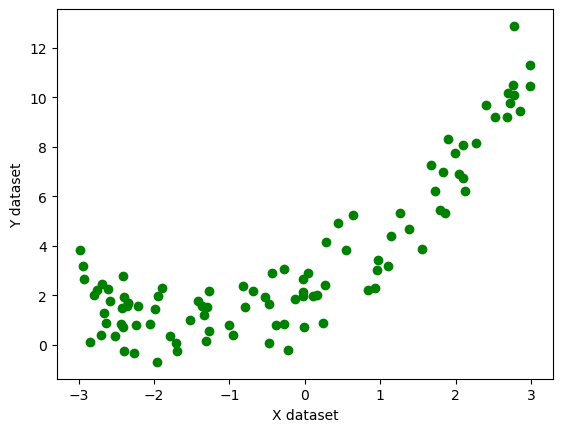
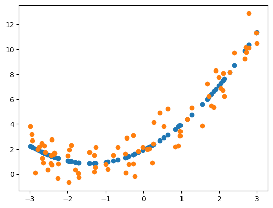
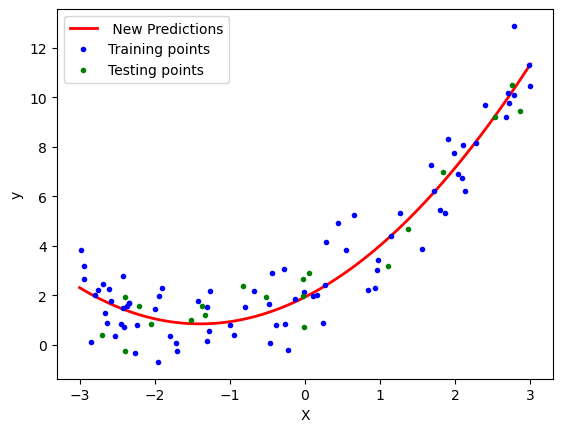
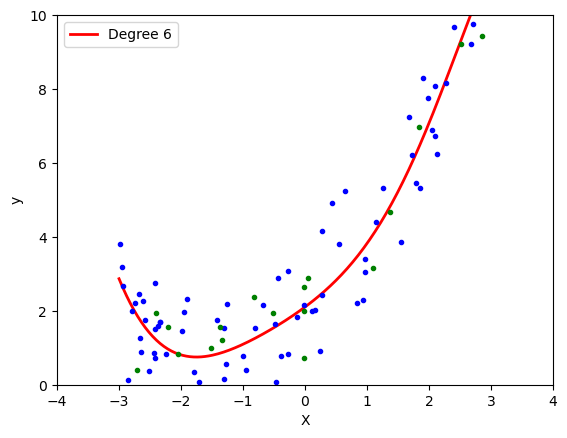

```python
import numpy as np
import pandas as pd
import matplotlib.pyplot as plt
%matplotlib inline 
```


```python
X = 6 * np.random.rand(100, 1) - 3
y =0.5 * X**2 + 1.5*X + 2 + np.random.randn(100, 1)
# quadratic equation used- y=0.5x^2+1.5x+2+outliers
plt.scatter(X,y,color='g')
plt.xlabel('X dataset')
plt.ylabel('Y dataset')
```


    Text(0, 0.5, 'Y dataset')


    

    


```python
from sklearn.model_selection import train_test_split
X_train,X_test,y_train,y_test=train_test_split(X,y,test_size=0.2,random_state=42)
```


```python
## Lets implement Simple Linear Regression
from sklearn.linear_model import LinearRegression
regression_1=LinearRegression()
```


```python
regression_1.fit(X_train,y_train)
```


<style>#sk-container-id-1 {color: black;background-color: white;}#sk-container-id-1 pre{padding: 0;}#sk-container-id-1 div.sk-toggleable {background-color: white;}#sk-container-id-1 label.sk-toggleable__label {cursor: pointer;display: block;width: 100%;margin-bottom: 0;padding: 0.3em;box-sizing: border-box;text-align: center;}#sk-container-id-1 label.sk-toggleable__label-arrow:before {content: "▸";float: left;margin-right: 0.25em;color: #696969;}#sk-container-id-1 label.sk-toggleable__label-arrow:hover:before {color: black;}#sk-container-id-1 div.sk-estimator:hover label.sk-toggleable__label-arrow:before {color: black;}#sk-container-id-1 div.sk-toggleable__content {max-height: 0;max-width: 0;overflow: hidden;text-align: left;background-color: #f0f8ff;}#sk-container-id-1 div.sk-toggleable__content pre {margin: 0.2em;color: black;border-radius: 0.25em;background-color: #f0f8ff;}#sk-container-id-1 input.sk-toggleable__control:checked~div.sk-toggleable__content {max-height: 200px;max-width: 100%;overflow: auto;}#sk-container-id-1 input.sk-toggleable__control:checked~label.sk-toggleable__label-arrow:before {content: "▾";}#sk-container-id-1 div.sk-estimator input.sk-toggleable__control:checked~label.sk-toggleable__label {background-color: #d4ebff;}#sk-container-id-1 div.sk-label input.sk-toggleable__control:checked~label.sk-toggleable__label {background-color: #d4ebff;}#sk-container-id-1 input.sk-hidden--visually {border: 0;clip: rect(1px 1px 1px 1px);clip: rect(1px, 1px, 1px, 1px);height: 1px;margin: -1px;overflow: hidden;padding: 0;position: absolute;width: 1px;}#sk-container-id-1 div.sk-estimator {font-family: monospace;background-color: #f0f8ff;border: 1px dotted black;border-radius: 0.25em;box-sizing: border-box;margin-bottom: 0.5em;}#sk-container-id-1 div.sk-estimator:hover {background-color: #d4ebff;}#sk-container-id-1 div.sk-parallel-item::after {content: "";width: 100%;border-bottom: 1px solid gray;flex-grow: 1;}#sk-container-id-1 div.sk-label:hover label.sk-toggleable__label {background-color: #d4ebff;}#sk-container-id-1 div.sk-serial::before {content: "";position: absolute;border-left: 1px solid gray;box-sizing: border-box;top: 0;bottom: 0;left: 50%;z-index: 0;}#sk-container-id-1 div.sk-serial {display: flex;flex-direction: column;align-items: center;background-color: white;padding-right: 0.2em;padding-left: 0.2em;position: relative;}#sk-container-id-1 div.sk-item {position: relative;z-index: 1;}#sk-container-id-1 div.sk-parallel {display: flex;align-items: stretch;justify-content: center;background-color: white;position: relative;}#sk-container-id-1 div.sk-item::before, #sk-container-id-1 div.sk-parallel-item::before {content: "";position: absolute;border-left: 1px solid gray;box-sizing: border-box;top: 0;bottom: 0;left: 50%;z-index: -1;}#sk-container-id-1 div.sk-parallel-item {display: flex;flex-direction: column;z-index: 1;position: relative;background-color: white;}#sk-container-id-1 div.sk-parallel-item:first-child::after {align-self: flex-end;width: 50%;}#sk-container-id-1 div.sk-parallel-item:last-child::after {align-self: flex-start;width: 50%;}#sk-container-id-1 div.sk-parallel-item:only-child::after {width: 0;}#sk-container-id-1 div.sk-dashed-wrapped {border: 1px dashed gray;margin: 0 0.4em 0.5em 0.4em;box-sizing: border-box;padding-bottom: 0.4em;background-color: white;}#sk-container-id-1 div.sk-label label {font-family: monospace;font-weight: bold;display: inline-block;line-height: 1.2em;}#sk-container-id-1 div.sk-label-container {text-align: center;}#sk-container-id-1 div.sk-container {/* jupyter's `normalize.less` sets `[hidden] { display: none; }` but bootstrap.min.css set `[hidden] { display: none !important; }` so we also need the `!important` here to be able to override the default hidden behavior on the sphinx rendered scikit-learn.org. See: https://github.com/scikit-learn/scikit-learn/issues/21755 */display: inline-block !important;position: relative;}#sk-container-id-1 div.sk-text-repr-fallback {display: none;}</style><div id="sk-container-id-1" class="sk-top-container"><div class="sk-text-repr-fallback"><pre>LinearRegression()</pre><b>In a Jupyter environment, please rerun this cell to show the HTML representation or trust the notebook. <br />On GitHub, the HTML representation is unable to render, please try loading this page with nbviewer.org.</b></div><div class="sk-container" hidden><div class="sk-item"><div class="sk-estimator sk-toggleable"><input class="sk-toggleable__control sk-hidden--visually" id="sk-estimator-id-1" type="checkbox" checked><label for="sk-estimator-id-1" class="sk-toggleable__label sk-toggleable__label-arrow">LinearRegression</label><div class="sk-toggleable__content"><pre>LinearRegression()</pre></div></div></div></div></div>


```python
from sklearn.metrics import r2_score
score=r2_score(y_test,regression_1.predict(X_test))
print(score)
```

    0.7837030021289481
    


```python
## Lets visualize this model
plt.plot(X_train,regression_1.predict(X_train),color='r')
plt.scatter(X_train,y_train)
plt.xlabel("X Dataset")
plt.ylabel("Y")
```


    Text(0, 0.5, 'Y')


    

    


```python
#LEts apply polynomial transformation
from sklearn.preprocessing import PolynomialFeatures
```


```python

poly=PolynomialFeatures(degree=2,include_bias=True)
X_train_poly=poly.fit_transform(X_train)
X_test_poly=poly.transform(X_test)
```


```python
from sklearn.metrics import r2_score
regression = LinearRegression()
regression.fit(X_train_poly, y_train)
y_pred = regression.predict(X_test_poly)
score=r2_score(y_test,y_pred)
print(score)
```

    0.9289092493847984
    


```python

print(regression.coef_)
```

    [[0.         1.51755031 0.54395748]]
    


```python
print(regression.intercept_)
```

    [1.93227893]
    


```python
plt.scatter(X_train,regression.predict(X_train_poly))
plt.scatter(X_train,y_train)
```


    <matplotlib.collections.PathCollection at 0x21f586d7190>


    

    


```python
poly=PolynomialFeatures(degree=3,include_bias=True)
X_train_poly=poly.fit_transform(X_train)
X_test_poly=poly.transform(X_test)
```


```python
from sklearn.metrics import r2_score
regression = LinearRegression()
regression.fit(X_train_poly, y_train)
y_pred = regression.predict(X_test_poly)
score=r2_score(y_test,y_pred)
print(score)
```

    0.9282364638719005
    


```python
#3 Prediction of new data set
X_new = np.linspace(-3, 3, 200).reshape(200, 1)
X_new_poly = poly.transform(X_new)
X_new_poly
```


    array([[ 1.00000000e+00, -3.00000000e+00,  9.00000000e+00,
            -2.70000000e+01],
           [ 1.00000000e+00, -2.96984925e+00,  8.82000455e+00,
            -2.61940839e+01],
           [ 1.00000000e+00, -2.93969849e+00,  8.64182723e+00,
            -2.54043665e+01],
           [ 1.00000000e+00, -2.90954774e+00,  8.46546804e+00,
            -2.46306834e+01],
           [ 1.00000000e+00, -2.87939698e+00,  8.29092700e+00,
            -2.38728702e+01],
           [ 1.00000000e+00, -2.84924623e+00,  8.11820409e+00,
            -2.31307624e+01],
           [ 1.00000000e+00, -2.81909548e+00,  7.94729931e+00,
            -2.24041955e+01],
           [ 1.00000000e+00, -2.78894472e+00,  7.77821267e+00,
            -2.16930052e+01],
           [ 1.00000000e+00, -2.75879397e+00,  7.61094417e+00,
            -2.09970269e+01],
           [ 1.00000000e+00, -2.72864322e+00,  7.44549380e+00,
            -2.03160961e+01],
           [ 1.00000000e+00, -2.69849246e+00,  7.28186157e+00,
            -1.96500486e+01],
           [ 1.00000000e+00, -2.66834171e+00,  7.12004747e+00,
            -1.89987196e+01],
           [ 1.00000000e+00, -2.63819095e+00,  6.96005151e+00,
            -1.83619449e+01],
           [ 1.00000000e+00, -2.60804020e+00,  6.80187369e+00,
            -1.77395600e+01],
           [ 1.00000000e+00, -2.57788945e+00,  6.64551400e+00,
            -1.71314004e+01],
           [ 1.00000000e+00, -2.54773869e+00,  6.49097245e+00,
            -1.65373017e+01],
           [ 1.00000000e+00, -2.51758794e+00,  6.33824903e+00,
            -1.59570993e+01],
           [ 1.00000000e+00, -2.48743719e+00,  6.18734375e+00,
            -1.53906289e+01],
           [ 1.00000000e+00, -2.45728643e+00,  6.03825661e+00,
            -1.48377260e+01],
           [ 1.00000000e+00, -2.42713568e+00,  5.89098760e+00,
            -1.42982262e+01],
           [ 1.00000000e+00, -2.39698492e+00,  5.74553673e+00,
            -1.37719649e+01],
           [ 1.00000000e+00, -2.36683417e+00,  5.60190399e+00,
            -1.32587778e+01],
           [ 1.00000000e+00, -2.33668342e+00,  5.46008939e+00,
            -1.27585003e+01],
           [ 1.00000000e+00, -2.30653266e+00,  5.32009293e+00,
            -1.22709681e+01],
           [ 1.00000000e+00, -2.27638191e+00,  5.18191460e+00,
            -1.17960166e+01],
           [ 1.00000000e+00, -2.24623116e+00,  5.04555441e+00,
            -1.13334815e+01],
           [ 1.00000000e+00, -2.21608040e+00,  4.91101235e+00,
            -1.08831982e+01],
           [ 1.00000000e+00, -2.18592965e+00,  4.77828843e+00,
            -1.04450023e+01],
           [ 1.00000000e+00, -2.15577889e+00,  4.64738264e+00,
            -1.00187294e+01],
           [ 1.00000000e+00, -2.12562814e+00,  4.51829499e+00,
            -9.60421498e+00],
           [ 1.00000000e+00, -2.09547739e+00,  4.39102548e+00,
            -9.20129460e+00],
           [ 1.00000000e+00, -2.06532663e+00,  4.26557410e+00,
            -8.80980380e+00],
           [ 1.00000000e+00, -2.03517588e+00,  4.14194086e+00,
            -8.42957813e+00],
           [ 1.00000000e+00, -2.00502513e+00,  4.02012575e+00,
            -8.06045315e+00],
           [ 1.00000000e+00, -1.97487437e+00,  3.90012878e+00,
            -7.70226438e+00],
           [ 1.00000000e+00, -1.94472362e+00,  3.78194995e+00,
            -7.35484739e+00],
           [ 1.00000000e+00, -1.91457286e+00,  3.66558925e+00,
            -7.01803772e+00],
           [ 1.00000000e+00, -1.88442211e+00,  3.55104669e+00,
            -6.69167090e+00],
           [ 1.00000000e+00, -1.85427136e+00,  3.43832226e+00,
            -6.37558249e+00],
           [ 1.00000000e+00, -1.82412060e+00,  3.32741597e+00,
            -6.06960803e+00],
           [ 1.00000000e+00, -1.79396985e+00,  3.21832782e+00,
            -5.77358307e+00],
           [ 1.00000000e+00, -1.76381910e+00,  3.11105780e+00,
            -5.48734316e+00],
           [ 1.00000000e+00, -1.73366834e+00,  3.00560592e+00,
            -5.21072383e+00],
           [ 1.00000000e+00, -1.70351759e+00,  2.90197217e+00,
            -4.94356064e+00],
           [ 1.00000000e+00, -1.67336683e+00,  2.80015656e+00,
            -4.68568912e+00],
           [ 1.00000000e+00, -1.64321608e+00,  2.70015909e+00,
            -4.43694483e+00],
           [ 1.00000000e+00, -1.61306533e+00,  2.60197975e+00,
            -4.19716331e+00],
           [ 1.00000000e+00, -1.58291457e+00,  2.50561854e+00,
            -3.96618011e+00],
           [ 1.00000000e+00, -1.55276382e+00,  2.41107548e+00,
            -3.74383077e+00],
           [ 1.00000000e+00, -1.52261307e+00,  2.31835055e+00,
            -3.52995083e+00],
           [ 1.00000000e+00, -1.49246231e+00,  2.22744375e+00,
            -3.32437585e+00],
           [ 1.00000000e+00, -1.46231156e+00,  2.13835509e+00,
            -3.12694137e+00],
           [ 1.00000000e+00, -1.43216080e+00,  2.05108457e+00,
            -2.93748292e+00],
           [ 1.00000000e+00, -1.40201005e+00,  1.96563218e+00,
            -2.75583607e+00],
           [ 1.00000000e+00, -1.37185930e+00,  1.88199793e+00,
            -2.58183636e+00],
           [ 1.00000000e+00, -1.34170854e+00,  1.80018181e+00,
            -2.41531932e+00],
           [ 1.00000000e+00, -1.31155779e+00,  1.72018383e+00,
            -2.25612051e+00],
           [ 1.00000000e+00, -1.28140704e+00,  1.64200399e+00,
            -2.10407546e+00],
           [ 1.00000000e+00, -1.25125628e+00,  1.56564228e+00,
            -1.95901974e+00],
           [ 1.00000000e+00, -1.22110553e+00,  1.49109871e+00,
            -1.82078888e+00],
           [ 1.00000000e+00, -1.19095477e+00,  1.41837327e+00,
            -1.68921842e+00],
           [ 1.00000000e+00, -1.16080402e+00,  1.34746597e+00,
            -1.56414392e+00],
           [ 1.00000000e+00, -1.13065327e+00,  1.27837681e+00,
            -1.44540091e+00],
           [ 1.00000000e+00, -1.10050251e+00,  1.21110578e+00,
            -1.33282495e+00],
           [ 1.00000000e+00, -1.07035176e+00,  1.14565289e+00,
            -1.22625158e+00],
           [ 1.00000000e+00, -1.04020101e+00,  1.08201813e+00,
            -1.12551635e+00],
           [ 1.00000000e+00, -1.01005025e+00,  1.02020151e+00,
            -1.03045479e+00],
           [ 1.00000000e+00, -9.79899497e-01,  9.60203025e-01,
            -9.40902462e-01],
           [ 1.00000000e+00, -9.49748744e-01,  9.02022676e-01,
            -8.56694904e-01],
           [ 1.00000000e+00, -9.19597990e-01,  8.45660463e-01,
            -7.77667662e-01],
           [ 1.00000000e+00, -8.89447236e-01,  7.91116386e-01,
            -7.03656283e-01],
           [ 1.00000000e+00, -8.59296482e-01,  7.38390445e-01,
            -6.34496312e-01],
           [ 1.00000000e+00, -8.29145729e-01,  6.87482639e-01,
            -5.70023294e-01],
           [ 1.00000000e+00, -7.98994975e-01,  6.38392970e-01,
            -5.10072775e-01],
           [ 1.00000000e+00, -7.68844221e-01,  5.91121436e-01,
            -4.54480300e-01],
           [ 1.00000000e+00, -7.38693467e-01,  5.45668039e-01,
            -4.03081416e-01],
           [ 1.00000000e+00, -7.08542714e-01,  5.02032777e-01,
            -3.55711666e-01],
           [ 1.00000000e+00, -6.78391960e-01,  4.60215651e-01,
            -3.12206597e-01],
           [ 1.00000000e+00, -6.48241206e-01,  4.20216661e-01,
            -2.72401755e-01],
           [ 1.00000000e+00, -6.18090452e-01,  3.82035807e-01,
            -2.36132685e-01],
           [ 1.00000000e+00, -5.87939698e-01,  3.45673089e-01,
            -2.03234932e-01],
           [ 1.00000000e+00, -5.57788945e-01,  3.11128507e-01,
            -1.73544042e-01],
           [ 1.00000000e+00, -5.27638191e-01,  2.78402061e-01,
            -1.46895560e-01],
           [ 1.00000000e+00, -4.97487437e-01,  2.47493750e-01,
            -1.23125031e-01],
           [ 1.00000000e+00, -4.67336683e-01,  2.18403576e-01,
            -1.02068003e-01],
           [ 1.00000000e+00, -4.37185930e-01,  1.91131537e-01,
            -8.35600187e-02],
           [ 1.00000000e+00, -4.07035176e-01,  1.65677634e-01,
            -6.74366251e-02],
           [ 1.00000000e+00, -3.76884422e-01,  1.42041868e-01,
            -5.35333672e-02],
           [ 1.00000000e+00, -3.46733668e-01,  1.20224237e-01,
            -4.16857906e-02],
           [ 1.00000000e+00, -3.16582915e-01,  1.00224742e-01,
            -3.17294409e-02],
           [ 1.00000000e+00, -2.86432161e-01,  8.20433827e-02,
            -2.34998634e-02],
           [ 1.00000000e+00, -2.56281407e-01,  6.56801596e-02,
            -1.68326037e-02],
           [ 1.00000000e+00, -2.26130653e-01,  5.11350723e-02,
            -1.15632073e-02],
           [ 1.00000000e+00, -1.95979899e-01,  3.84081210e-02,
            -7.52721969e-03],
           [ 1.00000000e+00, -1.65829146e-01,  2.74993056e-02,
            -4.56018635e-03],
           [ 1.00000000e+00, -1.35678392e-01,  1.84086260e-02,
            -2.49765278e-03],
           [ 1.00000000e+00, -1.05527638e-01,  1.11360824e-02,
            -1.17516448e-03],
           [ 1.00000000e+00, -7.53768844e-02,  5.68167471e-03,
            -4.28266938e-04],
           [ 1.00000000e+00, -4.52261307e-02,  2.04540289e-03,
            -9.25056585e-05],
           [ 1.00000000e+00, -1.50753769e-02,  2.27266988e-04,
            -3.42613550e-06],
           [ 1.00000000e+00,  1.50753769e-02,  2.27266988e-04,
             3.42613550e-06],
           [ 1.00000000e+00,  4.52261307e-02,  2.04540289e-03,
             9.25056585e-05],
           [ 1.00000000e+00,  7.53768844e-02,  5.68167471e-03,
             4.28266938e-04],
           [ 1.00000000e+00,  1.05527638e-01,  1.11360824e-02,
             1.17516448e-03],
           [ 1.00000000e+00,  1.35678392e-01,  1.84086260e-02,
             2.49765278e-03],
           [ 1.00000000e+00,  1.65829146e-01,  2.74993056e-02,
             4.56018635e-03],
           [ 1.00000000e+00,  1.95979899e-01,  3.84081210e-02,
             7.52721969e-03],
           [ 1.00000000e+00,  2.26130653e-01,  5.11350723e-02,
             1.15632073e-02],
           [ 1.00000000e+00,  2.56281407e-01,  6.56801596e-02,
             1.68326037e-02],
           [ 1.00000000e+00,  2.86432161e-01,  8.20433827e-02,
             2.34998634e-02],
           [ 1.00000000e+00,  3.16582915e-01,  1.00224742e-01,
             3.17294409e-02],
           [ 1.00000000e+00,  3.46733668e-01,  1.20224237e-01,
             4.16857906e-02],
           [ 1.00000000e+00,  3.76884422e-01,  1.42041868e-01,
             5.35333672e-02],
           [ 1.00000000e+00,  4.07035176e-01,  1.65677634e-01,
             6.74366251e-02],
           [ 1.00000000e+00,  4.37185930e-01,  1.91131537e-01,
             8.35600187e-02],
           [ 1.00000000e+00,  4.67336683e-01,  2.18403576e-01,
             1.02068003e-01],
           [ 1.00000000e+00,  4.97487437e-01,  2.47493750e-01,
             1.23125031e-01],
           [ 1.00000000e+00,  5.27638191e-01,  2.78402061e-01,
             1.46895560e-01],
           [ 1.00000000e+00,  5.57788945e-01,  3.11128507e-01,
             1.73544042e-01],
           [ 1.00000000e+00,  5.87939698e-01,  3.45673089e-01,
             2.03234932e-01],
           [ 1.00000000e+00,  6.18090452e-01,  3.82035807e-01,
             2.36132685e-01],
           [ 1.00000000e+00,  6.48241206e-01,  4.20216661e-01,
             2.72401755e-01],
           [ 1.00000000e+00,  6.78391960e-01,  4.60215651e-01,
             3.12206597e-01],
           [ 1.00000000e+00,  7.08542714e-01,  5.02032777e-01,
             3.55711666e-01],
           [ 1.00000000e+00,  7.38693467e-01,  5.45668039e-01,
             4.03081416e-01],
           [ 1.00000000e+00,  7.68844221e-01,  5.91121436e-01,
             4.54480300e-01],
           [ 1.00000000e+00,  7.98994975e-01,  6.38392970e-01,
             5.10072775e-01],
           [ 1.00000000e+00,  8.29145729e-01,  6.87482639e-01,
             5.70023294e-01],
           [ 1.00000000e+00,  8.59296482e-01,  7.38390445e-01,
             6.34496312e-01],
           [ 1.00000000e+00,  8.89447236e-01,  7.91116386e-01,
             7.03656283e-01],
           [ 1.00000000e+00,  9.19597990e-01,  8.45660463e-01,
             7.77667662e-01],
           [ 1.00000000e+00,  9.49748744e-01,  9.02022676e-01,
             8.56694904e-01],
           [ 1.00000000e+00,  9.79899497e-01,  9.60203025e-01,
             9.40902462e-01],
           [ 1.00000000e+00,  1.01005025e+00,  1.02020151e+00,
             1.03045479e+00],
           [ 1.00000000e+00,  1.04020101e+00,  1.08201813e+00,
             1.12551635e+00],
           [ 1.00000000e+00,  1.07035176e+00,  1.14565289e+00,
             1.22625158e+00],
           [ 1.00000000e+00,  1.10050251e+00,  1.21110578e+00,
             1.33282495e+00],
           [ 1.00000000e+00,  1.13065327e+00,  1.27837681e+00,
             1.44540091e+00],
           [ 1.00000000e+00,  1.16080402e+00,  1.34746597e+00,
             1.56414392e+00],
           [ 1.00000000e+00,  1.19095477e+00,  1.41837327e+00,
             1.68921842e+00],
           [ 1.00000000e+00,  1.22110553e+00,  1.49109871e+00,
             1.82078888e+00],
           [ 1.00000000e+00,  1.25125628e+00,  1.56564228e+00,
             1.95901974e+00],
           [ 1.00000000e+00,  1.28140704e+00,  1.64200399e+00,
             2.10407546e+00],
           [ 1.00000000e+00,  1.31155779e+00,  1.72018383e+00,
             2.25612051e+00],
           [ 1.00000000e+00,  1.34170854e+00,  1.80018181e+00,
             2.41531932e+00],
           [ 1.00000000e+00,  1.37185930e+00,  1.88199793e+00,
             2.58183636e+00],
           [ 1.00000000e+00,  1.40201005e+00,  1.96563218e+00,
             2.75583607e+00],
           [ 1.00000000e+00,  1.43216080e+00,  2.05108457e+00,
             2.93748292e+00],
           [ 1.00000000e+00,  1.46231156e+00,  2.13835509e+00,
             3.12694137e+00],
           [ 1.00000000e+00,  1.49246231e+00,  2.22744375e+00,
             3.32437585e+00],
           [ 1.00000000e+00,  1.52261307e+00,  2.31835055e+00,
             3.52995083e+00],
           [ 1.00000000e+00,  1.55276382e+00,  2.41107548e+00,
             3.74383077e+00],
           [ 1.00000000e+00,  1.58291457e+00,  2.50561854e+00,
             3.96618011e+00],
           [ 1.00000000e+00,  1.61306533e+00,  2.60197975e+00,
             4.19716331e+00],
           [ 1.00000000e+00,  1.64321608e+00,  2.70015909e+00,
             4.43694483e+00],
           [ 1.00000000e+00,  1.67336683e+00,  2.80015656e+00,
             4.68568912e+00],
           [ 1.00000000e+00,  1.70351759e+00,  2.90197217e+00,
             4.94356064e+00],
           [ 1.00000000e+00,  1.73366834e+00,  3.00560592e+00,
             5.21072383e+00],
           [ 1.00000000e+00,  1.76381910e+00,  3.11105780e+00,
             5.48734316e+00],
           [ 1.00000000e+00,  1.79396985e+00,  3.21832782e+00,
             5.77358307e+00],
           [ 1.00000000e+00,  1.82412060e+00,  3.32741597e+00,
             6.06960803e+00],
           [ 1.00000000e+00,  1.85427136e+00,  3.43832226e+00,
             6.37558249e+00],
           [ 1.00000000e+00,  1.88442211e+00,  3.55104669e+00,
             6.69167090e+00],
           [ 1.00000000e+00,  1.91457286e+00,  3.66558925e+00,
             7.01803772e+00],
           [ 1.00000000e+00,  1.94472362e+00,  3.78194995e+00,
             7.35484739e+00],
           [ 1.00000000e+00,  1.97487437e+00,  3.90012878e+00,
             7.70226438e+00],
           [ 1.00000000e+00,  2.00502513e+00,  4.02012575e+00,
             8.06045315e+00],
           [ 1.00000000e+00,  2.03517588e+00,  4.14194086e+00,
             8.42957813e+00],
           [ 1.00000000e+00,  2.06532663e+00,  4.26557410e+00,
             8.80980380e+00],
           [ 1.00000000e+00,  2.09547739e+00,  4.39102548e+00,
             9.20129460e+00],
           [ 1.00000000e+00,  2.12562814e+00,  4.51829499e+00,
             9.60421498e+00],
           [ 1.00000000e+00,  2.15577889e+00,  4.64738264e+00,
             1.00187294e+01],
           [ 1.00000000e+00,  2.18592965e+00,  4.77828843e+00,
             1.04450023e+01],
           [ 1.00000000e+00,  2.21608040e+00,  4.91101235e+00,
             1.08831982e+01],
           [ 1.00000000e+00,  2.24623116e+00,  5.04555441e+00,
             1.13334815e+01],
           [ 1.00000000e+00,  2.27638191e+00,  5.18191460e+00,
             1.17960166e+01],
           [ 1.00000000e+00,  2.30653266e+00,  5.32009293e+00,
             1.22709681e+01],
           [ 1.00000000e+00,  2.33668342e+00,  5.46008939e+00,
             1.27585003e+01],
           [ 1.00000000e+00,  2.36683417e+00,  5.60190399e+00,
             1.32587778e+01],
           [ 1.00000000e+00,  2.39698492e+00,  5.74553673e+00,
             1.37719649e+01],
           [ 1.00000000e+00,  2.42713568e+00,  5.89098760e+00,
             1.42982262e+01],
           [ 1.00000000e+00,  2.45728643e+00,  6.03825661e+00,
             1.48377260e+01],
           [ 1.00000000e+00,  2.48743719e+00,  6.18734375e+00,
             1.53906289e+01],
           [ 1.00000000e+00,  2.51758794e+00,  6.33824903e+00,
             1.59570993e+01],
           [ 1.00000000e+00,  2.54773869e+00,  6.49097245e+00,
             1.65373017e+01],
           [ 1.00000000e+00,  2.57788945e+00,  6.64551400e+00,
             1.71314004e+01],
           [ 1.00000000e+00,  2.60804020e+00,  6.80187369e+00,
             1.77395600e+01],
           [ 1.00000000e+00,  2.63819095e+00,  6.96005151e+00,
             1.83619449e+01],
           [ 1.00000000e+00,  2.66834171e+00,  7.12004747e+00,
             1.89987196e+01],
           [ 1.00000000e+00,  2.69849246e+00,  7.28186157e+00,
             1.96500486e+01],
           [ 1.00000000e+00,  2.72864322e+00,  7.44549380e+00,
             2.03160961e+01],
           [ 1.00000000e+00,  2.75879397e+00,  7.61094417e+00,
             2.09970269e+01],
           [ 1.00000000e+00,  2.78894472e+00,  7.77821267e+00,
             2.16930052e+01],
           [ 1.00000000e+00,  2.81909548e+00,  7.94729931e+00,
             2.24041955e+01],
           [ 1.00000000e+00,  2.84924623e+00,  8.11820409e+00,
             2.31307624e+01],
           [ 1.00000000e+00,  2.87939698e+00,  8.29092700e+00,
             2.38728702e+01],
           [ 1.00000000e+00,  2.90954774e+00,  8.46546804e+00,
             2.46306834e+01],
           [ 1.00000000e+00,  2.93969849e+00,  8.64182723e+00,
             2.54043665e+01],
           [ 1.00000000e+00,  2.96984925e+00,  8.82000455e+00,
             2.61940839e+01],
           [ 1.00000000e+00,  3.00000000e+00,  9.00000000e+00,
             2.70000000e+01]])


```python
y_new = regression.predict(X_new_poly)
plt.plot(X_new, y_new, "r-", linewidth=2, label=" New Predictions")
plt.plot(X_train, y_train, "b.",label='Training points')
plt.plot(X_test, y_test, "g.",label='Testing points')
plt.xlabel("X")
plt.ylabel("y")
plt.legend()
plt.show()
```


    

    


```python
from sklearn.pipeline import Pipeline
```


```python
def poly_regression(degree):
    X_new = np.linspace(-3, 3, 200).reshape(200, 1)
    
    poly_features=PolynomialFeatures(degree=degree,include_bias=True)
    lin_reg=LinearRegression()
    poly_regression=Pipeline([
        ("poly_features",poly_features),
        ("lin_reg",lin_reg)
    ])
    poly_regression.fit(X_train,y_train) ## ploynomial and fit of linear reression
    y_pred_new=poly_regression.predict(X_new)
    #plotting prediction line
    plt.plot(X_new, y_pred_new,'r', label="Degree " + str(degree), linewidth=2)
    plt.plot(X_train, y_train, "b.", linewidth=3)
    plt.plot(X_test, y_test, "g.", linewidth=3)
    plt.legend(loc="upper left")
    plt.xlabel("X")
    plt.ylabel("y")
    plt.axis([-4,4, 0, 10])
    plt.show()
    
```


```python
poly_regression(6)
```


    

    


```python

```
